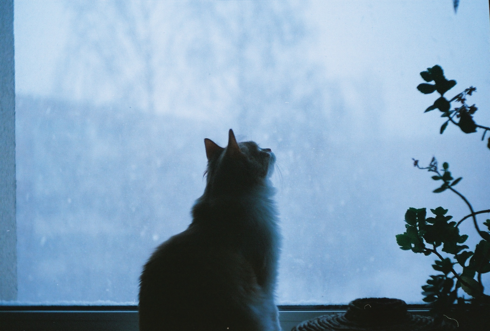
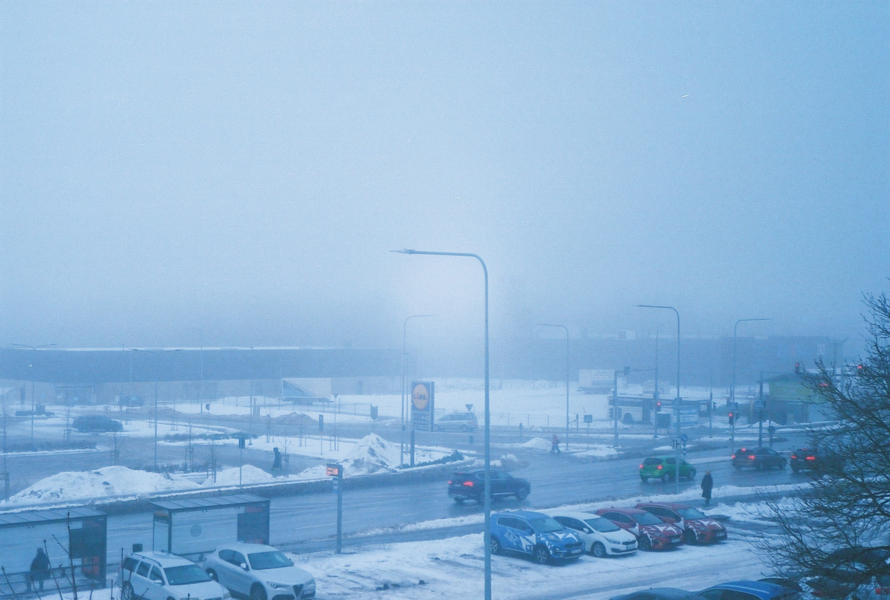

+++
title = 'Fed 2 & Kodak Ultramax 4'
date = 2024-01-22T17:29:06+02:00
draft = false
+++

Recently, I have received old FED 2 camera from my father-in-law. He was really tempted to see how this camera performs after years of sitting in the closet. 

To satisfy our excitement, I did not wait too long and put Kodak Ultramax 400 film inside (the most challenging film load I had to do so far) and snapped everything I saw around. 

The camera definitely shows its age, it was very hard to get decent focus out it. Frankly, I think I have failed focus on anything closer than infinity. Some of the ~~good~~ in-focus shots here:

The rest of it was mostly garbage, unfortunately.

Will I shoot with this camera again? Probably not, but hey, who knows? 

thank you, andri

